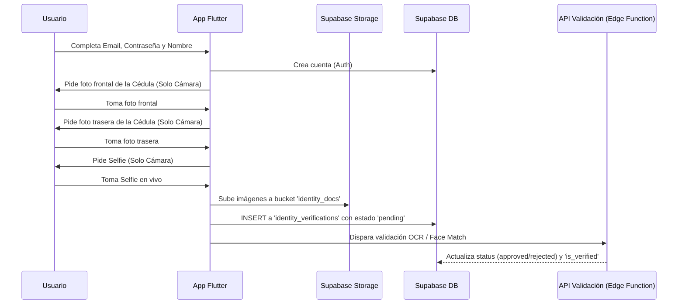

# Guía Técnica Completa - Proyecto Baratito

Esta guía detalla la arquitectura de base de datos, la configuración en Supabase, y las modificaciones necesarias para implementar un flujo seguro de registro con verificación de identidad (KYC - Know Your Customer) para la aplicación Baratito.

---

## 1. Arquitectura de Base de Datos

El esquema SQL proporcionado establece una base sólida para un marketplace de segunda mano (tipo OLX/MercadoLibre) enfocado en la seguridad y reputación.

### Tablas Principales
*   **`profiles`**: Extiende la tabla `auth.users` de Supabase. Almacena datos públicos, el rol (`buyer`, `seller`, `both`), nivel de confianza (`trust_score`), y el estado de verificación (`is_verified`).
*   **`identity_verifications`**: Tabla crítica para seguridad. Registra el proceso KYC de los usuarios, guardando las rutas de las fotos de la cédula, la selfie, los puntajes de coincidencia facial (`face_match_score`), y el estado de revisión.
*   **`products` & `categories`**: Catálogo de artículos en venta. Incluye estadísticas de visualizaciones y "likes".
*   **`orders` & `reviews`**: Gestiona el flujo de compra/venta y la calificación post-venta, lo cual retroalimenta el `seller_stats`.
*   **`conversations` & `messages`**: Chat en tiempo real entre comprador y vendedor asociado a un producto.
*   **`reports` & `audit_logs`**: Herramientas para moderación y administración.

---

## 2. Configuración Requerida en Supabase

Para que el ecosistema funcione correctamente y de forma segura, se debe configurar Supabase rigurosamente.

### A. Autenticación (Auth)
1.  **Email Confirmations**: Habilitar la confirmación de correo obligatoria en *Authentication > Providers > Email*.
2.  **Triggers (Funciones SQL)**: Crear un trigger en la base de datos que se ejecute en `after insert` sobre `auth.users` para insertar automáticamente un registro vacío en `public.profiles`.

### B. Storage (Almacenamiento de Archivos)
Deberás crear los siguientes *Buckets* en *Supabase Storage*:

1.  **`product_images` (Público)**: Para las fotos de los productos.
2.  **`avatars` (Público)**: Para las fotos de perfil de los usuarios.
3.  **`identity_docs` (PRIVADO - CRÍTICO)**: Aquí se guardarán las cédulas y selfies. **NUNCA** debe ser público. 
    *   *Regla RLS de Lectura:* Solo el usuario dueño de la foto y los administradores pueden leer.
    *   *Regla RLS de Escritura:* Solo el usuario dueño puede insertar archivos en su propia carpeta (ej. `identity_docs/{user_id}/cedula_front.jpg`).

### C. Row Level Security (RLS)
Se deben habilitar las políticas de seguridad (RLS) en todas las tablas. Ejemplos críticos:
*   **`identity_verifications`**: 
    *   Un usuario normal solo puede hacer `INSERT` o `SELECT` donde `user_id = auth.uid()`.
    *   Solo los roles de administración (verificables mediante JWT o tabla `admins`) pueden hacer `UPDATE` (para aprobar o rechazar).
*   **`profiles`**: 
    *   Lectura: Todos pueden leer (para ver la reputación de un vendedor).
    *   Escritura: El usuario solo puede actualizar su propio perfil (excluyendo campos sensibles como `is_verified` o `trust_score`).

---

## 3. Implementación de Verificación de Identidad (Registro Seguro)

Para garantizar la seguridad de la comunidad, el flujo de registro en Flutter debe exigir fotos en vivo de la cédula y una selfie.

### Flujo de Usuario (UX/UI)



### Modificaciones en la App Flutter

1.  **Dependencias Necesarias:**
    Deberás instalar y usar `image_picker` para acceder a la cámara nativa.
2.  **Forzar el uso estricto de la cámara (No Galería):**
    Cuando el usuario presione "Subir Cédula" o "Tomar Selfie", debes forzar el origen del archivo exclusivamente a la cámara. Esto evita que los estafadores suban fotos de cédulas robadas descargadas de internet.
    
    *Ejemplo de código Flutter:*
    ```dart
    final ImagePicker _picker = ImagePicker();
    
    // Captura estricta de cámara para la cédula y selfie
    final XFile? photo = await _picker.pickImage(
      source: ImageSource.camera, // ESTO ES CLAVE: Bloquea la galería
      imageQuality: 85,           // Optimización de tamaño
      preferredCameraDevice: CameraDevice.rear, // Para cédula (front para selfie)
    );
    ```

3.  **Gestión de Estados (Pantallas):**
    *   El usuario se registra pero su cuenta queda en un estado "Limitado".
    *   Si consulta la app, un *Middleware* (o en el `router.dart`) debe redirigirlo a la pantalla de verificación obligatoria si `is_verified == false` y no hay un registro pendiente en `identity_verifications`.
    *   Si el estado es `'pending'`, se le muestra una pantalla de "Estamos verificando tus datos".
    *   Si el estado es `'rejected'`, se le muestra el `rejection_reason` y se le permite volver a tomar las fotos.

### Procesamiento Backend (Supabase Edge Functions)

Para automatizar este flujo de los campos de la base de datos `ocr_extracted_name` y `face_match_score`, se recomienda crear una **Edge Function** en Supabase conectada a servicios como AWS Rekognition, Google Cloud Vision, o un proveedor de KYC especializado (ej. Veriff, Sumsub).

1.  **Trigger de Base de Datos:** Cuando se inserta un registro en `identity_verifications`, Supabase dispara un *Webhook* hacia la Edge Function.
2.  **Extracción de Datos (OCR):** La función analiza la foto de la cédula para extraer el `cedula_number` y el `ocr_extracted_name`.
3.  **Validación Facial (Face Match):** Se compara el rostro extraído de la cédula contra la `selfie_path`. Retorna un `face_match_score` (ej. 0.95).
4.  **Decisión Automática:**
    *   Si el OCR coincide con el `full_name` del perfil y el Face Match es > 0.85, la función hace un UPDATE automático:
        *   `identity_verifications.status = 'approved'`
        *   `profiles.is_verified = true`
    *   Si la calidad es mala o no coincide, pasa a revisión manual por un administrador (`status = 'pending'`), o se rechaza automáticamente solicitando un reintento.

### Consideraciones de Seguridad
*   Añadir metadatos en la toma de fotos (geolocalización y marca de tiempo).
*   Desactivar capturas de pantalla (`flutter_windowmanager`) durante el proceso de toma de cédula para prevenir clonación por malware local.
*   En el bucket de Supabase, asegurar estrictamente que el token del usuario sea quien firma la subida para evitar falsificación de identidad (Spoofing).
