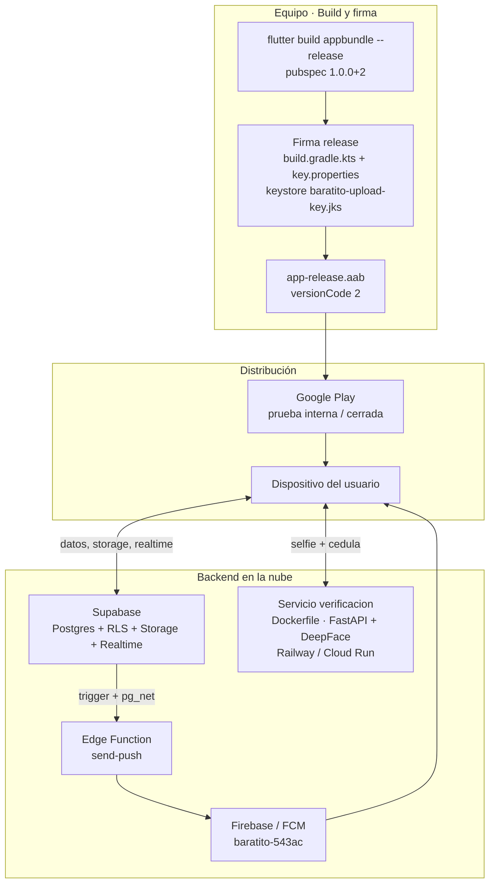

# Diagrama de despliegue — Baratito

Artefacto del bloque **"Despliegue"** (Grupo 4).
Muestra cómo cada pieza de Baratito llega a producción: la app móvil a Google
Play (bundle firmado), el microservicio de verificación facial como contenedor,
y el backend gestionado en Supabase + Firebase.

**Evidencia real detrás de este diagrama:**
- App: `flutter build appbundle --release` → `app-release.aab` (versionCode 2, `pubspec.yaml` = 1.0.0+2)
- Firma de release: `Frontend/android/app/build.gradle.kts` (signingConfigs "release") + `key.properties` + keystore `baratito-upload-key.jks`
- Servicio de verificación: `Backend/verification_service/Dockerfile` (FastAPI + DeepFace)
- Backend: Supabase (Postgres + RLS + Storage + Realtime) y Edge Function `supabase/functions/send-push/index.ts` (`supabase functions deploy send-push`)
- Push: Firebase / FCM (proyecto `baratito-543ac`, `google-services.json`)

## Paso a paso
1. **App móvil:** `flutter build appbundle --release` genera el `.aab`, que se **firma** con la configuración de release (`build.gradle.kts` + keystore) — sin firma válida, Google Play lo rechaza.
2. **Distribución controlada:** el bundle sube a Google Play y se reparte por pistas de prueba (interna/cerrada) antes de producción.
3. **Microservicio en contenedor:** la verificación facial se empaqueta con un `Dockerfile` y se despliega en la nube (Railway/Cloud Run), independiente de la PC del equipo.
4. **Backend serverless:** Supabase gestiona la base con RLS; la Edge Function `send-push` se despliega aparte y conecta con Firebase/FCM para las notificaciones.

**Idea clave:** un mismo producto se despliega en **tres planos distintos**
(móvil firmado, contenedor, backend serverless), cada uno con su propio
artefacto y su propio proceso de publicación.
