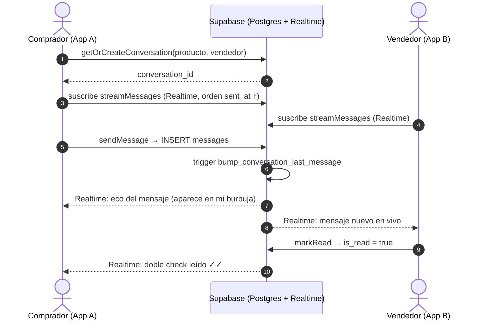

# Diagrama de secuencia — Chat en tiempo real (Baratito)

Muestra cómo comprador y vendedor conversan en vivo. Baratito usa **Supabase
Realtime**: al insertarse un mensaje, la base de datos lo **empuja** a los dos
dispositivos suscritos, sin que la app tenga que preguntar una y otra vez.

**Evidencia real:**
- `Frontend/lib/features/chat/data/chat_repository.dart` (`getOrCreateConversation`, `streamMessages`, `sendMessage`, `markRead`)
- `Backend/06_profile_chat_setup.sql` (tablas `conversations`/`messages` + trigger `bump_conversation_last_message` + Realtime)

## Paso a paso
1. **Una sola conversación por producto:** `getOrCreateConversation` evita duplicados (reutiliza la existente).
2. **Suscripción, no sondeo:** ambos se **suscriben** al stream; el servidor les avisa cuando hay algo nuevo.
3. **Orden correcto:** el stream pide `sent_at` ascendente, para que los mensajes nuevos aparezcan **abajo** (cronológico).
4. **Estado de lectura:** `markRead` cambia `is_read` y, por Realtime, el emisor ve el **doble check** al instante.
