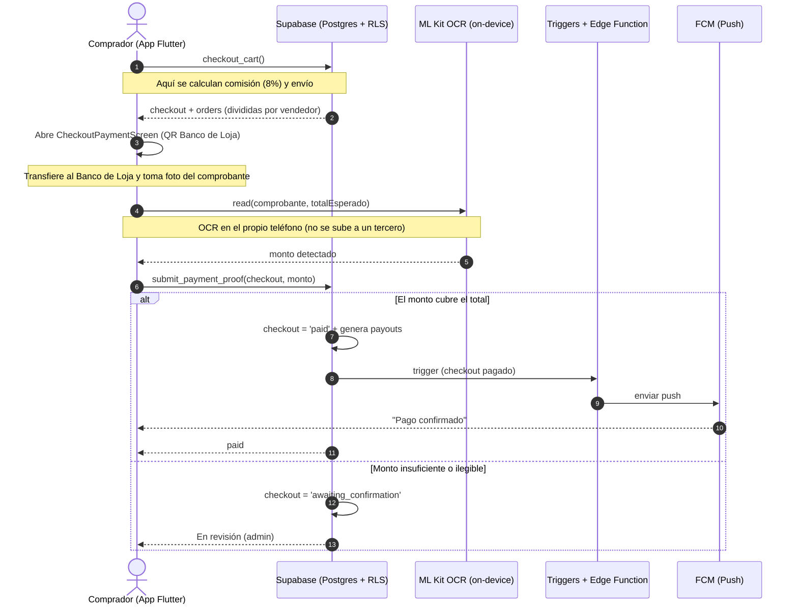

# Diagrama de secuencia — Flujo de pago con OCR (Baratito)

Artefacto del bloque **"Diagramas de secuencia"** (Grupo 4).
Representa el flujo real de pago de Baratito: el comprador paga por transferencia
al Banco de Loja de la plataforma, sube el comprobante y la app valida el monto
con OCR on-device; si cubre el total, se confirma solo y se generan los pagos a
los vendedores.

**Evidencia real detrás de este diagrama:**
- `Frontend/lib/features/cart/presentation/screens/cart_screen.dart`
- RPC `checkout_cart()` → `Backend/07_cart_favorites_checkout.sql`, `08_commission_payments.sql`, `11_payments_shipping_ocr.sql`
- `Frontend/lib/features/payments/presentation/checkout_payment_screen.dart`
- `Frontend/lib/features/payments/data/receipt_ocr_service.dart` (ML Kit, on-device)
- RPC `submit_payment_proof()` → `Backend/11_payments_shipping_ocr.sql`
- Triggers de notificación → `Backend/10_notifications_push.sql`

## Paso a paso
1. **Un pago, varios vendedores:** `checkout_cart()` crea un solo `checkout` y divide el pedido en `orders` por vendedor; aquí se calcula la comisión (8%) y el envío.
2. **Baratito recauda:** el comprador transfiere el total al Banco de Loja de la plataforma y sube el comprobante.
3. **OCR on-device:** ML Kit lee el monto en el propio teléfono, sin enviar el comprobante a un servidor externo.
4. **Auto-confirmación:** si el monto cubre el total, `submit_payment_proof()` marca `paid`, genera los `payouts` y dispara las notificaciones; si no, queda en revisión del admin.

**Por qué el ORDEN importa:** el monto del comprobante se valida **antes** de crear
los `payouts`. Si se invirtiera, se pagaría a los vendedores por checkouts sin
comprobante válido.
