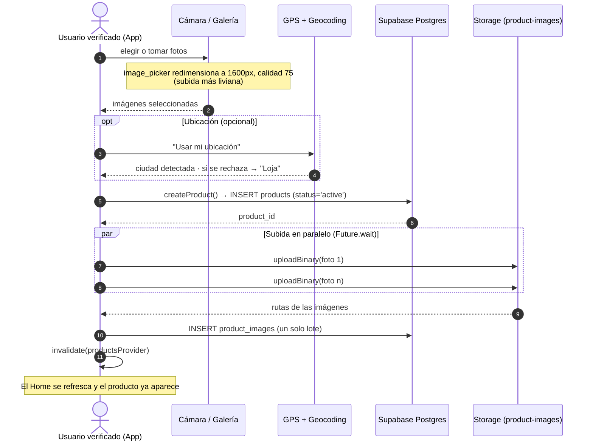

# Diagrama de secuencia — Publicar un producto (Baratito)

Muestra cómo un usuario **verificado** crea una publicación: elige fotos
(cámara o galería), opcionalmente comparte su ubicación, y la app sube todo a
Supabase de forma optimizada (imágenes en paralelo + una sola inserción).

**Evidencia real:**
- `Frontend/lib/features/products/presentation/screens/publish_product_screen.dart`
- `ProductRepository.createProduct()` → `Frontend/lib/features/products/data/product_repository.dart`
- Bucket público `product-images` · tablas `products` y `product_images`

## Paso a paso
1. **Gate previo:** el botón "+" solo publica si el perfil está verificado; si no, envía a `/verify`.
2. **Fotos optimizadas:** se redimensionan en el teléfono **antes** de subir, para que la publicación sea rápida y no gaste datos.
3. **Ubicación opcional:** si el usuario no da permiso, se usa **Loja** por defecto (no se bloquea la publicación).
4. **Optimización clave:** las imágenes se suben **en paralelo** y los registros se insertan en **una sola operación**, en vez de una por una.
