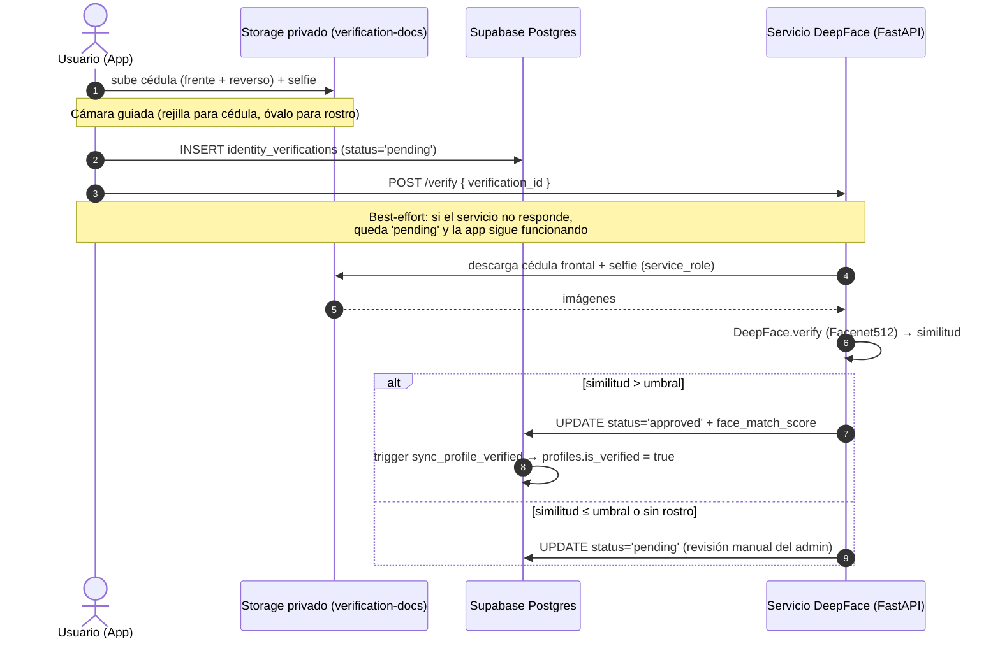

# Diagrama de secuencia — Verificación de identidad / KYC (Baratito)

Muestra cómo Baratito verifica que la persona sea real: sube cédula + selfie a
un bucket **privado**, y un microservicio en Python compara los rostros con IA
(DeepFace). El flujo es **híbrido**: aprueba automático si hay alta coincidencia
y, ante la duda, manda a **revisión humana** (nunca rechaza solo).

**Evidencia real:**
- `Frontend/lib/features/verification/data/verification_repository.dart`
- Servicio `Backend/verification_service/main.py` (FastAPI + DeepFace / Facenet512)
- `Backend/04_verification_setup.sql` (bucket privado + RLS + trigger `sync_profile_verified`)

## Paso a paso
1. **Datos sensibles protegidos:** las fotos van a un bucket **privado**; solo el propio usuario y el servicio (con `service_role`) pueden leerlas.
2. **Comparación con IA:** el servicio compara el selfie con la foto de la cédula usando el modelo Facenet512.
3. **Decisión híbrida:** alta coincidencia → aprobado automático; cualquier duda → revisión humana. **Nunca hay rechazo automático.**
4. **Efecto en la cuenta:** al aprobarse, un *trigger* marca `profiles.is_verified = true`, lo que habilita publicar y comprar.
